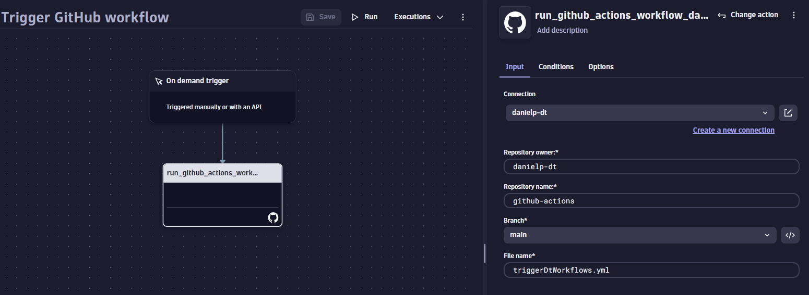
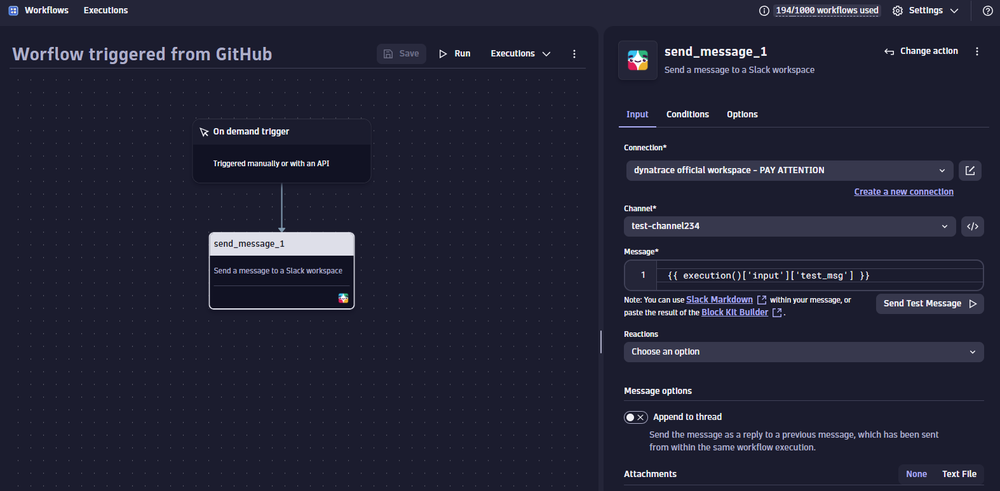

# Trigger Dynatrace Workflows

This action triggers a Dynatrace workflow by making use of your OAuth2 Client.

- uses Node 20
- logs every step
- returns the response body received after triggering the workflow

# Usage

<!-- start usage -->

## GitHub Action inputs

```yaml
- uses: danielp-dt/trigger-Dynatrace-workflows-action@v1.0.0
  with:
    # ID of your OAuth2 client
    # Required to run the action.
    client_id: ''

    # Secret of your OAuth2 client
    # Required to run the action.
    client_secret: ''

    # Tenant where the workflow is located.
    # Required to run the action.
    # Example: `tenant: 'vzx38435'`
    tenant: ''

    # Endpoint to decide in which environment the workflow is.
    # Default: 'https://sso.dynatrace.com'
    endpoint: ''

    # ID of the workflow that will be triggered.
    # Required to run the action.
    workflow_id: ''

    # Payload that will be used for the request.
    # Here you can pass all the parameters you want to use inside the workflow.
    # The payload has to be a JSON encoded string.
    # Default:
    # payload: |
    #    {
    #        "input": {},
    #        "params": {},
    #        "uniqueQualifier": ""
    #    }
    payload: ''
```

## Example GitHub workflow

- Helpful links
  - [Run a workflow with inputs](https://www.dynatrace.com/support/help/shortlink/workflows-running#run-a-workflow-with-inputs)

```yaml
# This is a basic workflow that triggers a Dynatrace workflow

name: 'trigger-dynatrace-workflow'

# Controls when the workflow will run
on:
  # Needed in order to trigger GitHub workflows via GitHub API
  workflow_dispatch:
# A workflow run is made up of one or more jobs that can run sequentially or in parallel
jobs:
  # This workflow contains a single job called "trigger_workflow"
  trigger_workflow:
    runs-on: ubuntu-latest
    environment: github-actions-secrets
    name: Test custom action
    steps:
      - name: Trigger Workflow
        id: triggerDtWorkflow
        uses: danielp-dt/trigger-Dynatrace-workflows-action@v1.0.0
        with:
          client_id: ${{ secrets.CLIENT_ID }}
          client_secret: ${{ secrets.CLIENT_SECRET }}
          tenant: 'vzx38435'
          endpoint: 'dev.apps.dynatracelabs.com'
          workflow_id: '3c9ef166-bae1-4c03-8b24-f19d32c9c42e'
          payload: |
            {
              "input": {
                "test_msg": "hello world via github"
              },
              "params": {},
              "uniqueQualifier": ""
            }
      - name: Get response body
        # Prints response body after triggering a Dynatrace workflow
        run: |
          echo Output body ${{ steps.triggerDtWorkflow.outputs.response_body }}
```

## Dynatrace Workflow

This workflow makes use of **Run GitHub actions workflow** action to trigger the earlier defined GitHub workflow.



## Triggered Dynatryce workflow

This workflow gets triggered by the GitHub Action and makes use of the input **test_msg** that we've defined earlier in the yaml file. The value defined inside **test_msg** will be sent to the Slack channel **test-channel234**.



## Result

After triggering the GitHub workflow with help of **Run GitHub actions workflow** action, depending on how much time GitHub will need to run the workflow, you'll see the Slack message in the end.


<!-- end usage -->
